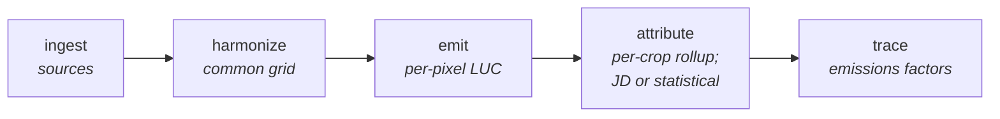

# Cornerstone LUC: system architecture and rationale

This document describes how the LUC pipeline is built and, more importantly, **why it is built this way** — the tooling, storage, and structural decisions behind the methodology in `methodology.md`. It is written for collaborators who bring domain expertise and/or software and data-engineering experience, so that they can get oriented quickly and match the style and philosophy of the repository.

The methodology itself — how emissions are quantified and attributed to crops — lives in `methodology.md`. This document is about the machine that runs it.

## Design ethos

A single principle runs through the choices below:

> **Start simple, allow validation at every step, choose designs that are easy to change, and keep our options open for cloud and data-orchestration infrastructure.**

Two habits follow from it:

- **Separation of concerns.** Geospatial ingestion, harmonization, and the methodological logic (detecting conversions, quantifying emissions, attributing them, and reducing them to factors) are different kinds of work with different failure modes. Keeping them in separate stages helps ensure that complexity — and the bugs that come with it — stays contained rather than leaking across boundaries. Ingestion in particular tends to require iteration and manual inspection, and we prefer to keep that work separate from the science.
- **Minimal structure, abstracted only when deep.** Following *A Philosophy of Software Design*, we tend to introduce an abstraction only once it becomes a *deep* module — a narrow interface hiding substantial complexity. Early on we kept structure minimal so that refactoring stayed cheap, and we favor flat layouts because they make onboarding and collaboration easier.

## Why Pangeo, not Earth Engine

The most consequential decision was to build on the [Pangeo](https://pangeo.io/) stack (xarray + dask + rasterio/rioxarray + GDAL, over object storage) rather than Google Earth Engine. There is no Earth Engine and no BigQuery anywhere in the pipeline: all raster work runs locally (or on any dask-capable host) and all outputs land as zarr and parquet under the configured roots — local directories or a GCS bucket.

We seriously considered staying on Earth Engine — it is the most *convenient* option, it offers the fastest wall-clock compute, and it is widely accepted in the field. We moved to Pangeo anyway, for reasons that all trace back to the ethos above:

- **Separation of concerns.** GEE merges the data catalog, ingestion, compute, and visualization into one system. That convenience is also its cost: complexity (and bugs) can span every layer at once. A staged Pangeo pipeline isolates ingestion from harmonization from methodology, so a problem in one stage stays in one stage.
- **Inspectability.** Being able to download every intermediate artifact and open it in QGIS, GDAL, or Python was essential to tracking down bugs and verifying their fixes. Exporting rasters out of Earth Engine is slow and expensive, which makes that tight inspect-fix-verify loop painful.
- **Local reproducibility and portability.** Running locally means results are quick to reproduce, execution is portable — the same code can be hoisted into a cloud VM or a data orchestrator — and deterministic, isolated unit tests can be written. GEE's hosted compute model does not allow that.
- **Keeping our options open.** Earth Engine is a great and complete tool, but adopting it for the catalog, ingestion, compute, *and* visualization forecloses experimentation with other tools that may be cheaper, better integrated, or more featureful. Pangeo keeps those doors open.

The trade-off we accept is some wall-clock speed and the convenience of a ready-made catalog, in exchange for isolation, inspectability, reproducibility, and flexibility which each help development more forwards faster and more confidently.

## The pipeline

The pipeline is a linear chain of five stages, each consuming the previous stage's output. The linearity is deliberate: it mirrors the separation of concerns and makes the dependency graph trivial to reason about.

- **Ingest** — download every external source dataset into `INGEST_ROOT` as tiled Cloud-Optimized GeoTIFFs (COGs, raster), FlatGeobuf (vector), or parquet (tabular), tagged with provenance metadata, and with minimal changes.
- **Harmonize** — align the ingested sources onto a common grid, one 10° tile at a time, yielding one lazy `xarray.Dataset` per tile backed by a zarr.
- **Emit** — compute per-pixel land conversion events and emissions as a lazy dask/xarray graph and persist to zarr.
- **Attribute** — clip per-pixel emissions to jurisdiction polygons and crop masks, rolling up to per-(jurisdiction, crop) totals via the jurisdictional-direct or statistical leg.
- **Trace** — join the attribution rollups to production (NASS yields for the direct leg, MapSPAM for the statistical leg) to produce the final emissions-factor table.

## Compute platform and libraries

Raster computation is expressed as lazy `xarray.Dataset` / `dask.array` graphs built with rioxarray and rasterio; GDAL VRTs do the grid alignment and resampling. Nothing materializes until a stage writes its result, at which point dask streams the computation tile-by-tile into the output store.

Each library earns its place:

- **dask** — careful chunking of the compute DAG is what makes it possible to process global 30 m datasets *on a laptop*. Chunked compute-and-write means no specialized hardware is ever needed.
- **xarray** — expressive, performant, and convenient for compute, validation, and testing. Labeled dimensions make the methodology code read close to how it is described.
- **rasterio / rioxarray** — Python entry points into most of the GDAL functionality that is needed (without having to become an expert in GDAL!).

Together the Pangeo stack delivers high performance *and* good development ergonomics without leaving the Python ecosystem.

Configuration comes from a `.env` file, loaded once via `config.Config.from_dot_env()`. `INGEST_ROOT` and `SCRATCH_ROOT` are URIs resolved through fsspec, so local directories and `gs://` buckets are interchangeable; `storage.to_gdal_path` rewrites `gs://` to `/vsigs/` for the GDAL readers and passes a local path through untouched. A `gs://` root needs application-default credentials (`gcloud auth application-default login`), with `GOOGLE_APPLICATION_CREDENTIALS` exported to the credentials file gcloud writes — gcsfs finds it without help, but GDAL's `/vsigs` reader does not. A local root needs absolute paths that already exist: `storage.open_zarr_to_dask_dataset` asserts the store it reopens is the URI it asked for, and xarray normalizes local paths to absolute, while parquet writes fail on a missing parent directory.

### No direct GDAL (rasterio only)

One restriction we adopted was to avoid using any GDAL tools directly, and instead rely on the subset of functionality exposed by the rasterio library. This costs us some capability and performance, but it avoids the overhead of installing GDAL, which often requires conda or a specialized Docker image. Instead, we can use simple virtual environments and keep our setup lean, fast, and portable.

## Storage and formats

The unifying theme is **chunked formats** — every store can be read and written in pieces, which is what keeps memory bounded end-to-end.

- **zarr** for raster outputs. Together with dask it lets the pipeline chunk both compute and write, so large rasters never have to fit in RAM. *(Visualization will likely use different formats down the line, e.g. XYZ-tiled COGs — a rendering concern, distinct from the analytical store.)*
- **parquet** for tabular outputs. Also chunked; it carries its own schema and interoperates with a wide range of tools.
- **FlatGeobuf** for vector data — a chunked, streamable vector format.
- **Cloud-Optimized GeoTIFF (COG)** for ingested rasters — the GDAL-native raster interchange format, trivially inspectable in QGIS/GDAL (which matters for the ingestion inspect-fix-verify loop), and structured for efficient windowed/range reads directly from object storage.
- **GCS** as the backing object store for the runs we publish from. At global scale this is a necessity rather than a preference: the pipeline needs somewhere that can cheaply absorb and store its TiBs of data and serve it back at high throughput. Nothing in the code requires it — the storage layer is fsspec-backed, and a country-scale run fits comfortably in local directories.

## Geospatial grid and harmonization

### The common grid

All rasters are harmonized onto the **GLAD GLCLUC native grid**: global `EPSG:4326` at 0.00025° (~30 m). We chose GLAD as the common grid because most of the source datasets are already provided in it, so warping *to* it minimizes resampling of the very layers that define land-cover transitions. It is also an intuitive grid and compatible with a tiled processing approach: the unit of work is a single 10° tile, and every grid is anchored on the absolute 10° graticule rather than on the extent of whatever was requested.

A second, coarser grid (the ~10 km MapSPAM resolution) exists for the statistical attribution leg, which downsamples per-pixel emissions to match the resolution of the MapSPAM crop statistics rather than implying a precision the crop data does not have.

### One VRT per band per tile — chunked end to end

Harmonization is **one GDAL VRT per source band per tile**. Each VRT declares the destination tile's grid — `EPSG:4326`, with a `<GeoTransform>` anchored on the absolute 10° graticule — and names the ingested COG as a single `<SimpleSource>` whose `SrcRect`, `DstRect`, and `resampling` attribute rescale the source onto that grid.

There is no reprojection step and no mosaic step:

- **No reprojection.** Every ingested COG is already `EPSG:4326` — `geo.validate_geotiff` asserts it at ingest — so the VRT only ever rescales and offsets within a single CRS. An earlier design added a second VRT pass (`rasterio.vrt.WarpedVRT`) to reproject; it was removed once the 4326-at-ingest invariant was enforced. (A `WarpedVRT` does survive in `geo.py`, where the statistical leg downsamples to the MapSPAM grid; it too is a same-CRS rescale.)
- **No mosaic.** The unit of work is one tile, so there is never more than one source per band to combine. Two source layouts are handled: ten-degree-tiled datasets (GLAD, GFW peatlands, Harris AGB, Huang BGB, SoilGrids, CDL, TCL) map a whole source tile onto the whole destination tile, while whole-world datasets (IPCC climate zones, MapSPAM) use `SrcRect` to window the tile's footprint out of the global raster.

A tile whose source was never published is tolerated when the caller opts in: the VRT is emitted with a band header and no source, which GDAL reads as all-nodata. A minority of tiles need this, and the emissions core coerces those nodatas to zero, so that "no data here" does not propagate as NaN.

Using VRTs rather than materializing intermediates is central to the design: the pipeline must be **fully chunked from end to end**, so that at no point is an entire raster dumped into RAM — doing so would cause massive slowdowns and out-of-memory failures. The VRTs are opened with rioxarray and assembled into one `xarray.Dataset`, one variable per fully-qualified source band (`{source}:{product}:{band}`).

### Per-dataset nodata, dtype, and resampling

Resampling is a per-dataset property: nearest-neighbor/mode for categorical layers (GLAD land classes, CDL, peatland mask, and climate zones) and bilinear/average for intensive layers (SoilGrids, Huang BGB, and Harris AGB). Extensive layers would be summed when downsampling, but this functionality isn't currently implemented. The nodata, dtype, and resampling conventions vary across the external datasets and must be **manually specified and validated** per dataset — these details matter, and getting them wrong silently corrupts downstream results, which is another reason ingestion is isolated and independently inspectable.

## Caching, versioning, and provenance

### Stage-output caching (`storage.cache_*`)

Stage outputs are cached under `SCRATCH_ROOT` by a pair of decorators in `storage.py`: `@storage.cache_to_zarr(version)` for `xarray.Dataset` results and `@storage.cache_to_parquet(version)` for `pandas.DataFrame` results. The cache key is a SHA1 over the function's module path, qualified name, the integer `version`, and the (non-ignored) call arguments; each decorator also accepts `ignored_args` for arguments that must not affect the key. On a hit the stage deserializes the stored result; on a miss it runs and serializes.

This is a deliberately **lightweight** way to get one of the nicest developer-experience features of a data orchestrator — cached, addressable stage outputs — *without committing to one*. When an operation is expensive its result should be cached; it should also be possible to manually inspect a materialization of that result and reference it via a static URI. The decorators additionally allow stages to be explicitly linked together (so a required upstream is generated when needed) without a lot of glue.

**Versioning is intentionally manual.** The cache key hashes the call arguments plus an integer `version`; the expectation is that whenever a function's *logic* or its *input datasets* change, the `version` is bumped. We accept the small risk of a forgotten bump in exchange for avoiding needless recomputation:

- The *ideal* would be content-based hashing of the arguments, the input datasets, and the function's logic. A promising path to that (without materializing results) would be to pass input datasets *by reference* and fold them into the hash, which would also narrow the scope of each cache version.
- Hashing on the git SHA would guarantee that stale results are never accidentally reused, but it would waste time and compute by invalidating on every commit, including cosmetic ones. That trade is a bad deal.

### Ingest-layer provenance

Provenance for *ingested* data is handled differently, and on purpose. Ingested datasets are best thought of as minimally-modified, analysis-ready copies of the external sources; they change rarely, so a more expensive and manual explicit approach is worthwhile. Each ingested COG carries metadata tags (`watershed-data-version`, `watershed-processing-version` = git SHA, `watershed-processing-time`, `watershed-source-name`, `watershed-product-name`, `watershed-remote-url`), and tiles are stored under a deterministic prefix `{source}/{product}/{version}/{partitioning}/{tile_id}`. The goal is that anyone who stumbles onto an artifact can understand how it was created and where to find more context.

The contrast is deliberate: **explicit provenance for slow-changing ingested sources; light, implicit cache keys for the internal logic that changes often.**

## Testing

Tests live in `jdluc/__tests__/` for the pipeline and `validation/__tests__/` for the validation tooling, and CI runs both. Unit tests cover pure logic (land-class mapping, grid math, chunking, transition/span weighting) against data the test itself supplies — a direct payoff of the local, deterministic execution model that motivated the move off Earth Engine. The validation suite works the same way, on invented rows in the user-assigned `XA` ISO range, so the report's failure paths are exercised without waiting for a real run to regress. The aim is for coverage to be high for core logic where logic resides and can change; much of the imperative shell is not automatically tested.

## Scale and scope

### Single host, by design

The pipeline runs on a single dask-capable host — no distributed cluster. We started on a single host because it is the simplest thing that works, and the tooling choices above mean the pipeline is not *stuck* there: much of the computation is parallelizable, and the same code is portable to a cloud VM or any of a number of data orchestrators (which would also bring their own versioning, metadata, caching, and monitoring). Staying local keeps that option open rather than closing it. Because the entire pipeline is chunkable end to end, there is no known ceiling: the working set is a single 10° tile no matter how many tiles are requested, so scaling up is a question of wall-clock time and where it is run — not of whether the host can hold the data.

The benchmark below is an **M4 MacBook (48 GB RAM)** with the default configuration, covering the 51 tiles of North America. It was measured on an earlier code path that built one region-sized grid per stage — which is why the rows are regional totals rather than per-tile. The per-tile path processes the same pixels and writes a comparable volume, but has not yet been re-benchmarked end to end, and tiles are currently processed serially with a dask `LocalCluster` spun up per tile. Treat the wall-clock column as the historical measurement it is, not as a current one:

| Stage                                     | Wall-clock | Cached output                       | Output size |
| ----------------------------------------- | ---------- | ----------------------------------- | ----------- |
| Ingest                                    | ~1 h       | source tiles (COG)                  | 36.4 GiB    |
| Harmonize                                 | ~1.5 h     | common-grid `xarray.Dataset` (zarr) | 4.1 TiB     |
| Emit                                      | ~2 h       | per-pixel emissions (zarr)          | 8.1 TiB     |
| Attribute (Statistical, downscale)        | ~3 h       | downscale (zarr)                    | 3.5 MiB     |
| Attribute (Statistical, rollup)           | ~15 m      | rollup (parquet)                    | < 1 MiB     |
| Attribute (Jurisdictional Direct, rollup) | ~15 m      | rollup (parquet)                    | < 1 MiB     |
| Trace                                     | ~1 m       | EF table (parquet)                  | < 1 MiB     |

End-to-end ≈ **8 h** for North America. Harmonize, emit, and attribute are the cost centers; storage is dominated by the two zarr stores. Attribute is compute-heavy despite its kilobyte-scale output because it streams the full per-pixel zarr through the clip/mask/rollup.

### Why the United States first

The proof of concept targets US crops for an architectural reason as well as a methodological one: the US has high-quality open data (notably CDL and NASS), which lends itself to a genuinely free and open implementation that is also accurate. Crucially, good input data isolates any discrepancies to the **methodology** rather than to data quality — exactly the kind of clean signal a proof of concept needs.
