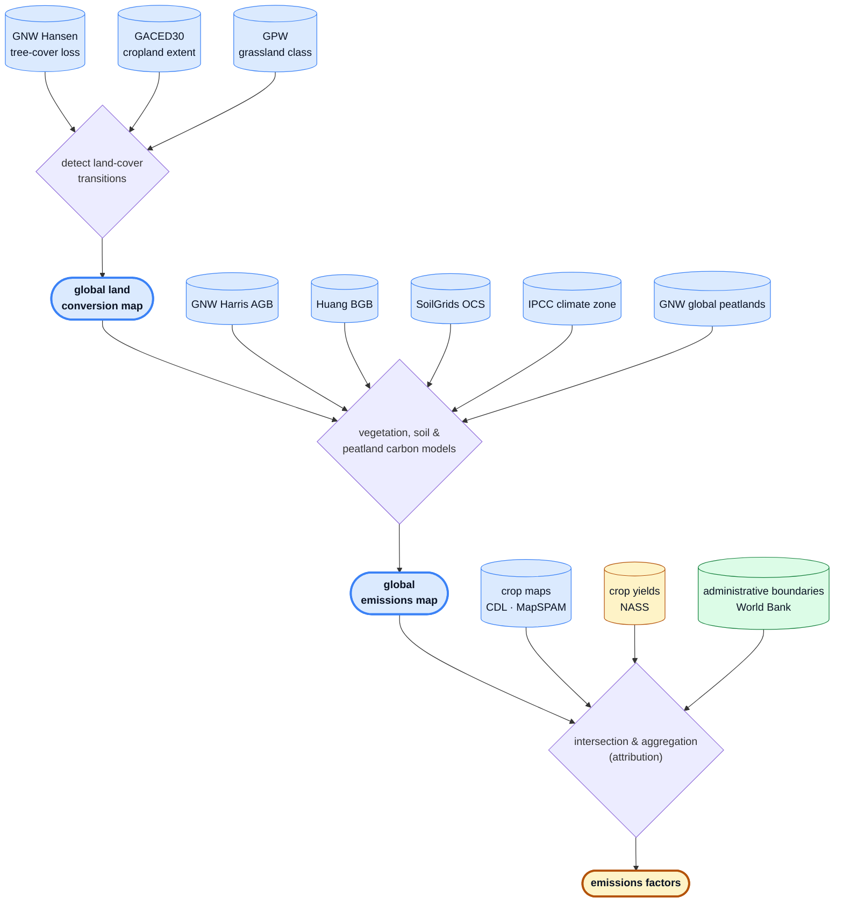

# Cornerstone LUC: methodology and approach

This document is a high-level overview of the datasets and emissions methodology implemented in this repository — *what* is computed and *why*, from a scientific standpoint. It is intended to be read on its own, and links out to the deeper references where they exist:

- `architecture.md` — the system architecture and the rationale behind the tooling, storage, and pipeline design (*how* it is built and *why those choices*).
- `data.md` — how to get the data products, grids, and full schemas for the harmonized inputs, per-pixel emissions, and emissions-factor table.
- `peatland_methodology_supplement.md` — the two-part peatland emissions model.
- `cdl_glad_comparison_supplement.md` — a historical record of the GLAD-cropland restriction, which the pipeline no longer applies.
- `further_research.md` — known limitations and areas for further research.

The pipeline quantifies the land-use-change (LUC) emissions associated with agricultural commodities and allocates them to specific crops. It supports two attribution methodologies that share a single per-pixel emissions core:

- **Jurisdictional direct** — high-resolution crop maps link emissions to crops by spatial intersection. Currently **United States only** (USDA Cropland Data Layer).
- **Statistical** — where only coarse crop statistics exist, emissions are attributed in proportion to each crop's share of local cropland expansion. This leg is **global** (IFPRI MapSPAM).

Both legs follow the GHGP Land Sector and Removals Standard's 20-year linearly-discounted lookback, and both roll up to World Bank administrative jurisdictions.

### At a glance

At a high level, the pipeline detects land-cover transitions and quantifies their emissions per pixel, then attributes those emissions to crops and jurisdictions to produce emissions factors — the three stages detailed in §§1–3 below.



**Legend.** Node **shape** encodes provenance, **fill color** encodes data format:

- **Shape** — cylinder = external dataset · stadium (bold border) = derived artifact · diamond = applied logic
- **Color** — blue = raster · amber = tabular · green = vector

A worked example of that flow on real data — soy in Matopiba, Brazil:


*Matopiba, Brazil. **Top left:** the five-year span each converted pixel was charged to, darkest most recent — clearance falls in a few blocks rather than advancing as a front, and most of it between 2006 and 2015. **Top right:** which of the five conversions fired — forest → cropland in those blocks, rangeland → cropland as the thin scatter across the western half, and a band of pasture → cropland down the southern frontier where soybean is now densest. **Bottom:** MapSPAM soybean area in 2000 and 2020, settling on the same blocks the top row shows converting. **Right:** the 20-year linearly-discounted per-hectare emissions those conversions released, before any crop is named — bright on the forest blocks and not on the rangeland scatter, because forest carries far more carbon per hectare. The statistical leg then divides these emissions among the crops and pastureland that expanded locally, in proportion to each one's share of that expansion.*

______________________________________________________________________

## 1. Datasets and grids

### Source datasets

Every input is ingested from its upstream publisher into cloud storage as tiled Cloud-Optimized GeoTIFFs (COGs, raster), FlatGeobuf (vector), or parquet (tabular), tagged with provenance metadata. One module per dataset lives under `jdluc/datasets/`. The ingestion and harmonization machinery that produces these analysis-ready copies is described in `architecture.md`.

| Dataset                            | Role                                                                                               | Source                                      | Kind    |
| ---------------------------------- | -------------------------------------------------------------------------------------------------- | ------------------------------------------- | ------- |
| **GNW Hansen tree-cover loss**     | Annual year of gross tree-cover loss, 2001-2025 — the forest source, and the only dated layer      | GNW/Hansen GFC-2025-v1.13                   | raster  |
| **GACED30 cropland extent**        | Annual cropland extent, 2000-2024 — the cropland destination                                       | Zenodo (doi:10.5281/zenodo.18199675)        | raster  |
| **GPW grassland class**            | Annual grassland class, 2000-2024 — the rangeland and pasture sources, and the pasture destination | Zenodo (doi:10.5281/zenodo.13890400)        | raster  |
| **Descals oil palm**               | Per-pixel oil palm planting year, 1989-2022 — the oil palm destination                             | Zenodo (doi:10.5281/zenodo.13379129)        | raster  |
| **GNW Harris AGB (2000)**          | Forest above-ground woody biomass                                                                  | GNW data-api (WHRC AGB v1.4)                | raster  |
| **Huang BGB**                      | Forest below-ground (root) biomass                                                                 | Figshare (doi:10.6084/m9.figshare.12199637) | raster  |
| **SoilGrids OCS (0–30 cm)**        | Soil organic carbon stock                                                                          | ISRIC SoilGrids (WCS)                       | raster  |
| **GNW Global Peatlands**           | Binary peatland mask                                                                               | GNW data-api (`gfw_peatlands` v20230315)    | raster  |
| **IPCC climate zones**             | Climate domain per pixel (drives IPCC factors)                                                     | Zenodo (doi:10.5281/zenodo.7303808)         | raster  |
| **USDA NASS CDL**                  | US per-pixel crop identity (jurisdictional-direct leg)                                             | USDA Cropland Data Layer                    | raster  |
| **IFPRI MapSPAM**                  | Global per-crop physical area + production, 2000/2005/2010/2020 (statistical leg)                  | Harvard Dataverse                           | raster  |
| **USDA NASS QuickStats**           | State-level crop yields (jurisdictional-direct production)                                         | NASS QuickStats API                         | tabular |
| **World Bank Official Boundaries** | Admin-0/1/2 jurisdiction polygons                                                                  | World Bank                                  | vector  |
| **FAOSTAT Production, livestock**  | National livestock stocks and meat production — ingestable, not read by either leg                 | FAO bulk download                           | tabular |
| **FAOSTAT Production, crops**      | National crop production and harvested area (validation yardstick)                                 | FAO bulk download                           | tabular |
| **GLAD GLCLUC v2**                 | Land cover / land-use time series (2000–2020) — ingestable, no longer read by the emissions core   | GLAD/Hansen GeoTIFFs                        | raster  |
| **GPW livestock headcount**        | Annual livestock heads per hectare, 2000/2005/2010/2020 — ingestable, not read by either leg       | Zenodo (doi:10.5281/zenodo.17491242)        | raster  |

The first nine rasters feed the per-pixel emissions core. CDL and MapSPAM feed the two attribution legs respectively. NASS yields and World Bank boundaries are joined downstream when building emissions factors.

The last three are ingested but feed neither leg, and are listed so the inventory matches `datasets.DatasetName`. FAOSTAT is the national production yardstick the validation tooling measures against — the global analogue of NASS QuickStats, and deliberately outside the attribution path so that no leg can consume the number it is measured by (see `validation.md`). GLAD GLCLUC is the land-cover series the emissions core read before the three annual layers replaced it, kept ingestable because the comparisons in `further_research.md` measure against it. GPW livestock is Global Pasture Watch's FAOSTAT-adjusted annual headcount of buffalo, cattle, goats, horses and sheep.

GPW grassland is native to the GLAD tile grid: its published mosaics are 0.00025° with pixel edges on whole degrees, so a ten-degree tile is a windowed read at an integer offset with no resampling. Its dominant-class band separates cultivated grassland from natural/semi-natural grassland and, new in v2, open shrubland — a split the land-cover series it replaced could not express, since those codes encode cover fraction rather than vegetation type. Reported F1 from five-fold spatially blocked cross-validation is 0.64 for cultivated and 0.76 for natural/semi-natural; both are v1 figures, and open shrubland arrives in v2-beta unvalidated.

Descals oil palm is the only per-crop extent layer in the inventory, and the only one that dates its own pixels: each 30 m pixel holds the year the plantation standing in 2021 was established, 0 where there is no oil palm. **It is read as extent, not as a date.** A pixel is an oil palm destination where its planting year is non-zero and no later than the assessment year; dating stays with tree-cover loss and the last grassland departure, as for every other conversion. The planting year does not date one, because a replant reads as the year it was replanted rather than as the year the land was first cleared — it bounds when the current crop was established, not when conversion happened. The upper bound is what tests the destination at the assessment year: a plantation established after 2020 is not yet evidence of what an earlier clearance was for, which excludes 2.2% of mapped palm globally. Extent accuracy is high on industrial plantations (producer's 91.0 ± 2.5%, user's 91.8 ± 1.2%) and much weaker on smallholders (71.4 ± 0.7% and 72.4 ± 1.8%); the planting year itself carries an RMSE of 2.65 years against field data. The publisher screens globally and then publishes only the 609 hundred-kilometre cells where oil palm was found, so 232 of the 280 ten-degree tiles touch no cell and are not ingested at all; a reader that opts into missing tiles sees them as zero, which is the right answer here, but it is the screen's recall that answers rather than a per-pixel classification. The companion 10 m industrial-versus-smallholder extent layer from the same record is not ingested: its palm footprint agrees with the planting-year layer to within 0.4%, so the only thing it adds is the two-way split, which would have to be mode-downsampled from 10 m onto the 27.8 m GLAD tile grid and would lose fragmented smallholder area in the process.

MapSPAM is the newest addition and the one that makes the statistical leg possible: it downscales sub-national crop statistics to a ~10 km (5 arc-minute) grid via a cross-entropy allocation, publishing physical area and production per crop for 2000, 2005, 2010, and 2020 (note: **no 2015 snapshot**). Its crop taxonomy is coarser in earlier years (the 2000 snapshot reports only 21, partly grouped, crops), which the statistical leg reconciles to a common per-crop taxonomy before use (see §3).

### Two grids

Every source is ingested in `EPSG:4326` and resampled onto one of two common grids, depending on which stage consumes them:

- **GLAD tile grid** — `EPSG:4326` at 0.00025° (~30 m), tiled on the 10° graticule. Everything in the emissions core and the jurisdictional-direct leg lives here.
- **MapSPAM grid** — the coarser ~10 km MapSPAM resolution. The statistical leg downsamples per-pixel emissions to this grid to match the resolution of the MapSPAM crop statistics, rather than implying a 30 m precision the underlying crop data does not have.

The choice of the GLAD tile grid as the common backbone, and the mechanics of resampling every source onto it one 10° tile at a time, are covered in `architecture.md`.

______________________________________________________________________

## 2. Quantifying emissions

The emissions core (`emit.py`) computes **per-pixel, per-span LUC emissions** on the GLAD tile grid, independent of any crop. This single layer feeds both attribution legs.

### Cataloguing transitions

Three annual layers decide what happened on a pixel, each answering one question. **Hansen tree-cover loss** gives the year a pixel lost its forest, and is the only dated layer. **GACED30** gives annual cropland extent. **Global Pasture Watch** gives an annual grassland class — cultivated, natural/semi-natural, or open shrubland.

A pixel's **source** is forest where tree-cover loss falls inside the lookback. Otherwise it is the grassland class the pixel most recently left: rangeland (natural or open shrubland) or pasture (cultivated grassland), whichever departure is the later. A tree-cover loss outranks a grassland departure, so a pixel that lost forest is never also charged grassland carbon.

A pixel's **destination** is read at the assessment year alone, against three layers in a fixed order: cropland where Descals maps oil palm established by 2020, then cropland where GACED30 calls it cropland in 2020, then pasture where Global Pasture Watch calls it cultivated grassland. A per-crop layer outranks both general ones, being the more specific evidence, and cropland outranks pasture, so the resolved destinations are disjoint. The layers themselves are not: every layer that claims a pixel is recorded, so a contested pixel stays visible in the emitted `destination-dataset` band even though only one layer resolves it.

Source and destination together name one of five conversions, each releasing the pools its row and column carry:

|                                           | **→ cropland** (Descals or GACED30 at 2020) | **→ pasture** (GPW cultivated at 2020) |
| ----------------------------------------- | ------------------------------------------- | -------------------------------------- |
| **forest →** (dated by tree-cover loss)   | forest biomass + mineral soil               | forest biomass                         |
| **rangeland →** (dated by last departure) | grassland biomass + mineral soil            | grassland biomass                      |
| **pasture →** (dated by last departure)   | grassland biomass + mineral soil            | *churn, not a conversion*              |

A pixel matching none of these emits nothing — there is no default row to fire on it. Pasture that stays pasture is churn rather than conversion, and rangeland that becomes natural rangeland again is not a conversion to any commodity. The soil column is where a pasture destination differs: it leaves the ground at its grassland reference state, so the mineral term is accounted and zero rather than absent, and on peat the drainage pulse replaces that term rather than adding to it (§ Carbon stocks and fluxes).

**No two layers are ever required to agree on a year**, which is the most counter-intuitive choice here and is deliberate. Dating belongs to tree-cover loss where the source is forest and to the last grassland departure otherwise; the destination is only ever tested at the assessment year. Requiring the destination layer to confirm the conversion in the same year — or even inside the same five-year span — discards the large majority of identified forest losses, because a cleared pixel takes years to read as cropland or pasture in a 30 m annual classification.

Two static per-pixel attributes are also catalogued: a binary **peatland** flag and the **IPCC climate domain**.

### Carbon stocks and fluxes

For each emissive transition, emissions are the sum of carbon lost from vegetation and soil. Each carbon pool is either read from a harmonized source layer or looked up from published factors; refer to `emit.py` for the specific values.

1. **Vegetation carbon**

   - Above-ground biomass — Harris et al. (2021) for forests; a climate-domain lookup derived from the BLUE bookkeeping model (Hansis et al., 2015) for grassland/shrubland.
   - Root (below-ground) biomass — Huang et al. (2021), with a root-to-shoot-ratio fallback where Huang data is missing.
   - Dead organic matter (dead wood + litter) — forests only, estimated as a fraction of above-ground biomass following UNFCCC CDM AR-TOOL-12. IPCC Tier 1 treats non-forest dead organic matter as zero, so it is excluded for grassland/shrubland.

   Forest conversions differentiate all three vegetation pools; rangeland and pasture use a single combined vegetation-carbon value. Each conversion releases the whole of its source stock: there is no destination stock to subtract, because the five conversions name the pools they release rather than differencing two land classes.

2. **Soil organic carbon**

   - Mineral soils — the IPCC 2019 Tier 1 stock-change method (Vol 4, Ch 5) applied to the SoilGrids 0–30 cm stock, using land-use-change factors keyed on the destination and climate domain. A pasture destination leaves the soil at its grassland reference state, so its land-use and management factors are both 1.0 and the mineral term is accounted and zero rather than absent.
   - Peatland — a two-part model calibrated to the IPCC 2013 Wetlands Supplement: an initial drainage **pulse** (discounted over time as a transition) plus a flat annual **occupation** emission that continues for as long as the peatland stays under cultivation. The derivation is in `peatland_methodology_supplement.md`.

### Allocation to crop years (GHGP linear discounting)

All fluxes are first computed as if the conversion were instantaneous, then allocated over time using the 20-year linearly-discounted lookback prescribed by the GHGP Land Sector and Removals Standard (§7.2.1): the more recently a conversion occurred, the more heavily its emissions are weighted. A conversion is dated to the year its source class ended and charged to the five-year span containing that year, and the GHGP's per-year weights are aggregated into one weight per span as the unbiased mean of that span's candidate conversion years (`SPAN_TO_LINEAR_DISCOUNT_WEIGHT` in `emit.py`). The span stays the accounting unit even though tree-cover loss dates annually, because it is what the MapSPAM snapshots behind the statistical leg can speak to.

The per-pixel result is a discounted sum of span conversion emissions plus the current year's peatland occupation emissions, scaled by pixel area. This same temporal ramp is shared by both attribution methodologies.

### What the emissions layer contains

Every unit of gross land-carbon decrease inside the lookback falls into one of six buckets. The first two are what the layer charges; the next three are reported beside it and reconcile with the first two to the gross total; the last is out of frame.

| #   | Bucket                                             | What is in it                                                                                                                                      |
| --- | -------------------------------------------------- | -------------------------------------------------------------------------------------------------------------------------------------------------- |
| 1   | **Charged, attributed to a commodity**             | The five conversions, where a destination resolved                                                                                                 |
| 2   | **Charged, no commodity named**                    | Cropland at the assessment year whose crop this pipeline does not model                                                                            |
| 3   | **Dropped: attributable, no destination evidence** | Source carbon whose pixel neither layer claims at the assessment year — the majority of tropical forest-loss carbon                                |
| 4   | **Dropped: attributable, no destination layer**    | Tree crops other than oil palm, plantation forest for timber and pulp, mangrove → aquaculture, and peat drainage riding on any of these            |
| 5   | **Dropped: emissive, attributable to nobody**      | Forest → built-up, and forest → natural rangeland                                                                                                  |
| 6   | **Out of frame**                                   | Clearance before the lookback opens; degradation short of clearing the stand; regrowth, which the LSRS treats as a removal rather than a reduction |

Buckets 3 to 5 are published per pixel as `dropped-emissions`, deliberately outside `emissions-per-hectare` so that no total silently contains carbon charged to nobody.

The claim this supports, restricted to conversions that are both emissive and attributable to a commodity: **complete for annual-cropland, oil palm and pasture destinations, and blind to every other woody and aquatic commodity destination**. Oil palm is the one woody perennial with a dedicated destination layer; cocoa, coconut, rubber, coffee, tea and plantation timber have none here and remain in bucket 4. Buckets 3 and 4 are conformance gaps rather than scoping preferences — LSRS Requirement 11 names tree crops and plantation forest explicitly. Bucket 5 is a legitimate scope choice, since neither destination is attributable to a commodity, but both are still reported.

______________________________________________________________________

## 3. Attribution and emissions factors

Attribution turns the crop-agnostic per-pixel emissions layer into per-(jurisdiction, crop) totals, and then into emissions factors. `attribute.py` dispatches each country to one of two methodologies, fanning out over the ten-degree tiles that country touches and summing the per-tile partials (see [`coverage.md`](coverage.md) for the full country list and the territorial extent rule), and `trace.py` converts the rollups into the final emissions-factor table. Both legs clip to provincial (World Bank admin-1) polygons.

### Shared framing

Both legs quantify and allocate LUC emissions to a crop from a specific region in the same way. The crop's sourcing year is specified and a 20-year lookback window is defined, then that window is split into spans for which land use is known at both the start and end. Within each span, conversions from high- to low-carbon-density states are identified and the associated carbon emissions are quantified (§2), attributing them to all production within the lookback window. To more strongly penalize production that follows land conversion more quickly, emissions are discounted using a linear temporal ramp. Because this step operates independently on every pixel, it applies globally and is shared between the direct and statistical methodologies.

### Jurisdictional direct (`jurisdictional_direct.py`)

Direct attribution is possible when the spatial resolution is high enough to unambiguously link emissions to specific crop production through spatial intersection. Where such traceability is available, the emissions factor is reduced by summing attributed emissions within the traced region and dividing by total production in that region — an aggregation that works for individual fields as well as district-, provincial-, and national-level jurisdictions.

Concretely, for each (jurisdiction, crop):

1. Clip the per-pixel emissions to the admin-1 polygon.
2. Mask to the crop's CDL codes (via the `Crop` enum).
3. Sum emissions (including the forest- and peatland-conversion components), crop hectares, peatland crop hectares, and peatland-occupation emissions over the masked pixels.

Because direct attribution relies only on **current** production, production is later computed as crop area × NASS QuickStats yield (a multi-year state-level mean), converting NASS's reported yield per acre to kg/ha. NASS publishes that yield in four units — bushels, pounds, hundredweight and short tons per acre — and which one applies is a property of the commodity, so `usda_nass_quickstats.CropSeries` carries the unit and its weight per crop. The bushel weights are marketing bushels, from table 6 of USDA Agricultural Handbook 697 (ERS, June 1992), rather than the grading test weights of 7 CFR 810, which are a different quantity. Cotton is the one crop whose published yield is not the harvested crop: NASS reports ginned lint where MapSPAM and FAOSTAT carry seed cotton, so the lint yield is divided by a lint fraction of 0.36. This leg currently asserts `iso_3166 == "USA"`, since CDL is US-only.

### Statistical (`statistical.py`)

When crop production is only available at low spatial resolution, spatial intersection is ambiguous and a statistical model is needed instead. The assumption is that emissions are driven by agricultural expansion: within a coarse spatial cell, emissions are attributed to each commodity in proportion to its share of total expansion (retractions are ignored). Whereas direct attribution relies only on current production, the statistical leg is estimated from multiple spans — the emissions factor is reduced over a traceability region by summing attributed emissions across spans and dividing by the sum of linearly discounted production across those same spans, again aggregating to district-, provincial-, or national-level jurisdictions.

Concretely:

1. Downsample the per-pixel emissions to the MapSPAM ~10 km grid — per-span conversion emissions and their source split, the cropland and pastureland peatland-occupation bands, and pasture extent at each MapSPAM snapshot.
2. For each MapSPAM span, compute each commodity's **expansion** and its **share** of total expansion in that cell. A crop's expansion is the positive change in its MapSPAM physical area; pastureland's is the positive change in the hectares Global Pasture Watch calls cultivated grassland, measured the same way. Because MapSPAM has no 2015 snapshot, the 2010→2015 and 2015→2020 spans both use the 2010→2020 expansion. The total is built by clipping each commodity's own movement, exactly as its numerator is, so the shares sum to **at most** one.
3. Attribute each span's emissions to commodities by that span's expansion share, weighting by the same GHGP span discount weights.
4. Compute each crop's production denominator as a discount-weighted average over the lookback window (described below), rather than a single current-year snapshot.

**Pastureland is an expansion term and a row of its own.** Grazing land is inside the boundary the LSRS draws, and forest cleared for pasture emits whether or not a crop ever follows, so pasture takes its share of the cell alongside the crops and appears in the output as `PASTURE`. This matches the external references, which divide by cropland plus cultivated pasture rather than by cropland alone. The consequence for every crop is that its share is diluted by whatever pasture expanded beside it — in pasture-led frontiers that is most of the cell. The row carries area but no production, because MapSPAM measures none for pasture, so no emissions factor is published for it.

Peatland occupation is allocated differently from conversion, because it is a land-management flux on land that is drained *now* and has no relationship to expansion. It is split by each commodity's share of occupied area instead, and the two occupation bands keep the crop and pasture halves apart: the split is made on the 30 m grid, where cropland and cultivated grassland are separable, so nothing has to assume how peat, pasture and cropland sit relative to one another inside a 10 km cell.

**The unattributed remainder is discarded, not reassigned.** Because the shares sum to at most one, part of each cell's conversion emissions corresponds to expansion by MapSPAM crops this leg does not model — citrus, cocoa, rubber, vegetables and ten others. Those crops get no row, so that fraction is simply dropped: it is charged to nobody. Two consequences follow. Each modeled commodity's factor is unaffected, which is the point — a crop is not charged for a neighbour's expansion. But the emissions-factor table still accounts for less than the whole of a landscape's conversion emissions, and **summing its rows does not give a jurisdiction's LUC total** — the `DROPPED` row closes the other half of that shortfall, the carbon no destination layer claimed, but this share-based remainder has no row and is inferable only from the shortfall itself. Peatland-occupation shares are formed the same way and discard a comparable fraction. See "MapSPAM crops that first appear in a later snapshot read as expansion from zero" in `further_research.md`, which is the largest single contributor to it.

This leg is global; MapSPAM crops are modeled with a broader `Crop` enum (maize, soybean, wheat, rice, oil palm, coffee, and more; see `statistical.py`).

**Reconciling MapSPAM's crop taxonomy.** Because MapSPAM's crop list is coarser in 2000 than in later years, any crop that appears only in the finer later-year taxonomy must be recovered from its 2000 group. The 2000 group total is decomposed into its constituent crops, assuming each constituent's within-group share matches its share of the group pooled over the later snapshots (`DECOMPOSITION_REFERENCE_YEARS`, 2005/2010/2020). Pooling rather than deferring to the nearest year is deliberate: a pixel the 2000 snapshot places a group in but 2005 does not is an inconsistency between MapSPAM's own releases, not a crop that arrived later.

Each quantity is split by its own distribution — production by the pooled production share, physical area by the pooled area share — and both are used, so all spans speak a single crop taxonomy. Splitting production by area would assume every constituent of a group yields the same in that pixel, which they do not; bananas outyield plantains several-fold.

Where no reference year places the group in a pixel there is no basis for a split at all. Two of the six 2000 groups have a catch-all constituent (`GROUP_TO_RESIDUAL_NAME`: "other oil crops" and "other pulses"), which absorbs the whole unattributable remainder rather than handing a slice to every named sibling. The other four have none, so the total is split evenly across constituents as a last resort. That last resort is not rare: measured across the MapSPAM snapshots it divides 18.1 Mt of 2000 production and 4.84 Mha of area — about 7.7% of the four affected groups — among crops that may not grow in the pixel at all. Its effect on a finished factor is nonetheless bounded well under a percent, because the 2000 snapshot is the only thing the decomposition touches and it carries 6.25% of the emissions numerator and 3.13% of the production denominator. See "MapSPAM group decomposition falls back to an even split" in `further_research.md`.

**Tropical woody-perennial factors other than oil palm are lower bounds.** GACED30 admits woody crops in principle, but measured against independent references it recovers only a small fraction of them — 1.1% and 0.3% of mapped oil palm on two Riau windows — so a woody perennial with no layer of its own is one of the destinations bucket 4 above is blind to, and the conversion emissions reaching coffee, coconut and rubber are far below what external references report. Those crops' factors should be read as lower bounds rather than estimates until a per-crop destination layer supplies what the general cropland mask cannot. Oil palm has one, so its factor is no longer bounded that way; `further_research.md` covers the mechanism for the rest, and separately a smaller allocation gap specific to oil palm. The asymmetry worth naming is that MapSPAM's expansion denominator *does* see these crops, so they dilute every other crop's share in the cells they grow in while collecting almost none of the emissions themselves.

**Windowed production denominator (a departure from WRI).** The emissions numerator is time-resolved: it links conversion emissions to each crop's *historical* expansion, weighted by recency. Dividing that by a single *current-year* production snapshot — as in WRI's methodology — would place the numerator and denominator on inconsistent time bases. A crop that expanded early in the window and then contracted would carry real conversion emissions against a shrunken (or zero) present-day production, yielding an inflated or undefined emissions factor. Instead, production is reduced over the same 20-year lookback window using the same linear temporal ramp applied to emissions: each span's production is the mean of its two MapSPAM snapshot years, weighted by that span's discount weight and normalized by the sum of the weights. This ties emission allocation and production to the same years with the same recency weighting. When production is flat across the window the result reduces exactly to the current-production value; it diverges only when production actually changed. This consistent linkage is a material improvement over attributing historical-expansion emissions to present-day production alone.

### From rollups to emissions factors (`trace.py`)

`trace.py` takes the attribution rollup and derives the emissions factor identically for both methodologies — the only methodology-specific step is where production comes from (NASS yield × area for direct; MapSPAM production for statistical):

```
emissions_factor_kgco2e_per_kg = Σ emissions / Σ production
```

Provincial (admin-1) rows are then summed up to national (admin-0) totals. The final output is a `pandas.DataFrame` indexed by `(admin_level, admin_id, commodity_name, methodology)` with crop hectares, peatland crop hectares, emissions (with the forest, grassland, peatland-conversion and peatland-occupation components broken out), production, and the emissions factor; see `data.md` for the full column schema. The full stage-by-stage pipeline that produces this table, and how its outputs are cached, is described in `architecture.md`.

______________________________________________________________________

## Supporting documents

Primary datasets and standards this methodology depends on. Exact values, factors, and codes referenced above live in the source code.

**Land cover & carbon-stock datasets**

- Gross tree-cover loss — Hansen et al. (2013), served as Global Nature Watch GFC-2025-v1.13. https://doi.org/10.1126/science.1244693
- Annual cropland extent — GACED30, Chen et al. (2026) dataset, described in Liao et al. (2026). https://doi.org/10.5281/zenodo.18199675
- Annual grassland class — Global Pasture Watch, Parente et al. (2025), v2-beta; the concept DOI resolves to the latest of the series. https://doi.org/10.5281/zenodo.13890400
- GLAD GLCLUC v2 land cover — Potapov et al. (2022). https://doi.org/10.3389/frsen.2022.856903
- Forest above-ground biomass — Harris et al. (2021). https://doi.org/10.1038/s41558-020-00976-6
- Forest root biomass — Huang et al. (2021). https://doi.org/10.5194/essd-13-4263-2021
- Soil organic carbon stock — ISRIC SoilGrids.
- Peatland extent — Global Nature Watch Global Peatlands.
- Climate domain — Lewis (2022) raster, built from the IPCC 2019 Refinement decision tree. https://doi.org/10.5281/zenodo.7303808

**Crop & jurisdiction datasets**

- US per-pixel crop identity — USDA NASS Cropland Data Layer (CDL).
- Global per-crop area & production — IFPRI MapSPAM.
- US crop yields — USDA NASS QuickStats.
- Jurisdiction boundaries — World Bank Official Boundaries.

**Methodological standards**

- Emissions allocation — GHG Protocol Land Sector and Removals Standard.
- Mineral-soil stock change — 2019 Refinement to the 2006 IPCC Guidelines, Vol 4, Ch 5.
- Peatland emissions — 2013 IPCC Wetlands Supplement.
- Dead organic matter — UNFCCC CDM AR-TOOL-12.
- Grassland/shrubland vegetation carbon — BLUE bookkeeping model (Hansis et al., 2015). https://doi.org/10.1002/2014GB004997
- Yield unit conversion — USDA Agricultural Handbook 697, table 6 (marketing bushel weights).
