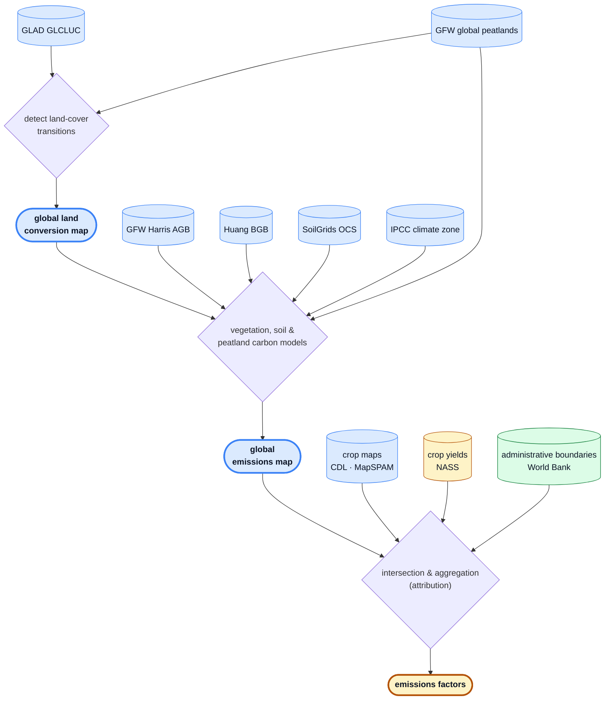
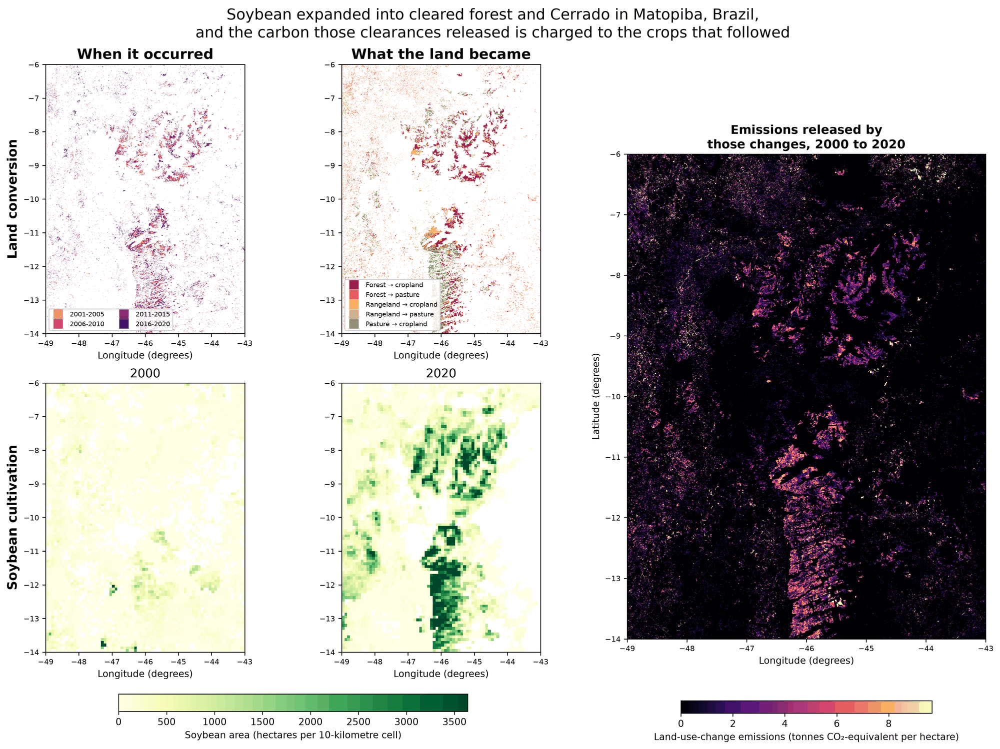

# Cornerstone LUC: methodology and approach

This document is a high-level overview of the datasets and emissions methodology implemented in this repository — *what* is computed and *why*, from a scientific standpoint. It is intended to be read on its own, and links out to the deeper references where they exist:

- `architecture.md` — the system architecture and the rationale behind the tooling, storage, and pipeline design (*how* it is built and *why those choices*).
- `data.md` — how to get the data products, grids, and full schemas for the harmonized inputs, per-pixel emissions, and emissions-factor table.
- `peatland_methodology_supplement.md` — the two-part peatland emissions model.
- `cdl_glad_comparison_supplement.md` — validation of the GLAD-cropland restriction against CDL row crops.
- `further_research.md` — known limitations and areas for further research.

The pipeline quantifies the land-use-change (LUC) emissions associated with agricultural commodities and allocates them to specific crops. It supports two attribution methodologies that share a single per-pixel emissions core:

- **Jurisdictional direct** — high-resolution crop maps link emissions to crops by spatial intersection. Currently **United States only** (USDA Cropland Data Layer).
- **Statistical** — where only coarse crop statistics exist, emissions are attributed in proportion to each crop's share of local cropland expansion. This leg is **global** (IFPRI MapSPAM).

Both legs follow the GHGP Land Sector and Removals Standard's 20-year linearly-discounted lookback, and both roll up to World Bank administrative jurisdictions.

### At a glance

At a high level, the pipeline detects land-cover transitions and quantifies their emissions per pixel, then attributes those emissions to crops and jurisdictions to produce emissions factors — the three stages detailed in §§1–3 below.



**Legend.** Node **shape** encodes provenance, **fill color** encodes data format:

- **Shape** — cylinder = external dataset · stadium (bold border) = derived artifact · diamond = applied logic
- **Color** — blue = raster · amber = tabular · green = vector

A worked example of that flow on real data — soy in Matopiba, Brazil:



*Matopiba, Brazil, showing the 2000 and 2020 endpoints of the five-epoch GLAD series (2000/2005/2010/2015/2020) for conciseness. **Top:** GLAD land cover before/after — cropland (amber) expands into forest and Cerrado. **Bottom:** MapSPAM soybean area before/after — soy floods the same belts. **Right:** the resulting 20-year-discounted per-hectare LUC emissions (crop-agnostic). The statistical leg attributes these emissions to soy in proportion to its share of local cropland expansion.*

______________________________________________________________________

## 1. Datasets and grids

### Source datasets

Every input is ingested from its upstream publisher into cloud storage as tiled Cloud-Optimized GeoTIFFs (COGs, raster), FlatGeobuf (vector), or parquet (tabular), tagged with provenance metadata. One module per dataset lives under `jdluc/datasets/`. The ingestion and harmonization machinery that produces these analysis-ready copies is described in `architecture.md`.

| Dataset                            | Role                                                                              | Source                                      | Kind    |
| ---------------------------------- | --------------------------------------------------------------------------------- | ------------------------------------------- | ------- |
| **GLAD GLCLUC v2**                 | Land cover / land-use time series (2000–2020, 5-year spans) — the backbone        | GLAD/Hansen GeoTIFFs                        | raster  |
| **GFW Harris AGB (2000)**          | Forest above-ground woody biomass                                                 | GFW data-api (WHRC AGB v1.4)                | raster  |
| **Huang BGB**                      | Forest below-ground (root) biomass                                                | Figshare (doi:10.6084/m9.figshare.12199637) | raster  |
| **SoilGrids OCS (0–30 cm)**        | Soil organic carbon stock                                                         | ISRIC SoilGrids (WCS)                       | raster  |
| **GFW Global Peatlands**           | Binary peatland mask                                                              | GFW data-api (`gfw_peatlands` v20230315)    | raster  |
| **IPCC climate zones**             | Climate domain per pixel (drives IPCC factors)                                    | Zenodo (doi:10.5281/zenodo.7303808)         | raster  |
| **USDA NASS CDL**                  | US per-pixel crop identity (jurisdictional-direct leg)                            | USDA Cropland Data Layer                    | raster  |
| **IFPRI MapSPAM**                  | Global per-crop physical area + production, 2000/2005/2010/2020 (statistical leg) | Harvard Dataverse                           | raster  |
| **USDA NASS QuickStats**           | State-level crop yields (jurisdictional-direct production)                        | NASS QuickStats API                         | tabular |
| **World Bank Official Boundaries** | Admin-0/1/2 jurisdiction polygons                                                 | World Bank                                  | vector  |
| **FAOSTAT Production**             | National crop production and harvested area (validation yardstick)                | FAO bulk download                           | tabular |
| **GFW Hansen tree-cover loss**     | Annual gross tree-cover loss, 2001-2025 (forest-detection comparison)             | GFW/Hansen GFC-2025-v1.13                   | raster  |

The first six rasters feed the per-pixel emissions core. CDL and MapSPAM feed the two attribution legs respectively. NASS yields and World Bank boundaries are joined downstream when building emissions factors.

The last two are ingested but feed neither leg, and are listed so the inventory matches `datasets.DatasetName`. FAOSTAT is the national production yardstick the validation tooling measures against — the global analogue of NASS QuickStats, and deliberately outside the attribution path so that no leg can consume the number it is measured by (see `validation.md`). Hansen tree-cover loss is held for the GLAD forest-detection comparison described in `further_research.md`.

MapSPAM is the newest addition and the one that makes the statistical leg possible: it downscales sub-national crop statistics to a ~10 km (5 arc-minute) grid via a cross-entropy allocation, publishing physical area and production per crop for 2000, 2005, 2010, and 2020 (note: **no 2015 snapshot**). Its crop taxonomy is coarser in earlier years (the 2000 snapshot reports only 21, partly grouped, crops), which the statistical leg reconciles to a common per-crop taxonomy before use (see §3).

### Two grids

Every source is ingested in `EPSG:4326` and resampled onto one of two common grids, depending on which stage consumes them:

- **GLAD grid** — the GLAD GLCLUC native resolution of ~30 m. Everything in the emissions core and the jurisdictional-direct leg lives here.
- **MapSPAM grid** — the coarser ~10 km MapSPAM resolution. The statistical leg downsamples per-pixel emissions to this grid to match the resolution of the MapSPAM crop statistics, rather than implying a 30 m precision the underlying crop data does not have.

The choice of the GLAD grid as the common backbone, and the mechanics of resampling every source onto it one 10° tile at a time, are covered in `architecture.md`.

______________________________________________________________________

## 2. Quantifying emissions

The emissions core (`emit.py`) computes **per-pixel, per-span LUC emissions** on the GLAD 30 m grid, independent of any crop. This single layer feeds both attribution legs.

### Cataloguing transitions

For every ~30 m pixel a land-cover time series is built across the five GLAD epochs (2000 → 2005 → 2010 → 2015 → 2020) from the GLAD GLCLUC v2 maps (Potapov et al., 2022). GLAD's 8-bit codes are collapsed into a 7-member `LandClass` enum (Forest, Grassland, Cropland, Built-up, Water, Snow/ice, Ocean; see `datasets/glad_glcluc.py`). Consecutive epochs are compared and each transition's source and destination class is recorded.

Only transitions from a **higher-carbon** state (e.g. forest, grassland) to a **lower-carbon** state (e.g. cropland, built-up) generate emissions. Reverse transitions represent removals, which this methodology does not currently count. Two static per-pixel attributes are also catalogued: a binary **peatland** flag and the **IPCC climate domain**.

### Carbon stocks and fluxes

For each emissive transition, emissions are the sum of carbon lost from vegetation and soil. Each carbon pool is either read from a harmonized source layer or looked up from published factors; refer to `emit.py` for the specific values.

1. **Vegetation carbon**

   - Above-ground biomass — Harris et al. (2021) for forests; a climate-domain lookup derived from the BLUE bookkeeping model (Hansis et al., 2015) for grassland/shrubland.
   - Root (below-ground) biomass — Huang et al. (2021), with a root-to-shoot-ratio fallback where Huang data is missing.
   - Dead organic matter (dead wood + litter) — forests only, estimated as a fraction of above-ground biomass following UNFCCC CDM AR-TOOL-12. IPCC Tier 1 treats non-forest dead organic matter as zero, so it is excluded for grassland/shrubland.

   Forest conversions differentiate all three vegetation pools; grassland/shrubland use a single combined vegetation-carbon value. Forest → grassland loses only the difference in vegetation carbon between the two states, whereas forest → cropland or built-up loses the full forest vegetation carbon.

2. **Soil organic carbon**

   - Mineral soils — the IPCC 2019 Tier 1 stock-change method (Vol 4, Ch 5) applied to the SoilGrids 0–30 cm stock, using land-use-change factors keyed on the destination land class and climate domain (built-up reuses the cropland factor as a proxy).
   - Peatland — a two-part model calibrated to the IPCC 2013 Wetlands Supplement: an initial drainage **pulse** (discounted over time as a transition) plus a flat annual **occupation** emission that continues for as long as the peatland stays under cultivation. The derivation is in `peatland_methodology_supplement.md`.

### Allocation to crop years (GHGP linear discounting)

All fluxes are first computed as if the transition were instantaneous, then allocated over time using the 20-year linearly-discounted lookback prescribed by the GHGP Land Sector and Removals Standard (§7.2.1): the more recently a conversion occurred, the more heavily its emissions are weighted. Because GLAD resolves transitions only to 5-year spans, the GHGP's per-year weights are aggregated into one weight per span as the unbiased mean of that span's candidate conversion years (`SPAN_TO_LINEAR_DISCOUNT_WEIGHT` in `emit.py`).

The per-pixel result is a discounted sum of span transition emissions plus the current year's peatland occupation emissions, scaled by pixel area. This same temporal ramp is shared by both attribution methodologies.

______________________________________________________________________

## 3. Attribution and emissions factors

Attribution turns the crop-agnostic per-pixel emissions layer into per-(jurisdiction, crop) totals, and then into emissions factors. `attribute.py` dispatches each country to one of two methodologies, fanning out over the ten-degree tiles that country touches and summing the per-tile partials (see [`coverage.md`](coverage.md) for the full country list and the territorial extent rule), and `trace.py` converts the rollups into the final emissions-factor table. Both legs clip to provincial (World Bank admin-1) polygons and restrict to pixels that GLAD classifies as cropland in 2020.

### Shared framing

Both legs quantify and allocate LUC emissions to a crop from a specific region in the same way. The crop's sourcing year is specified and a 20-year lookback window is defined, then that window is split into spans for which land use is known at both the start and end. Within each span, conversions from high- to low-carbon-density states are identified and the associated carbon emissions are quantified (§2), attributing them to all production within the lookback window. To more strongly penalize production that follows land conversion more quickly, emissions are discounted using a linear temporal ramp. Because this step operates independently on every pixel, it applies globally and is shared between the direct and statistical methodologies.

### Jurisdictional direct (`jurisdictional_direct.py`)

Direct attribution is possible when the spatial resolution is high enough to unambiguously link emissions to specific crop production through spatial intersection. Where such traceability is available, the emissions factor is reduced by summing attributed emissions within the traced region and dividing by total production in that region — an aggregation that works for individual fields as well as district-, provincial-, and national-level jurisdictions.

Concretely, for each (jurisdiction, crop):

1. Clip the per-pixel emissions to the admin-1 polygon.
2. Mask to the crop's CDL codes (via the `Crop` enum), optionally intersected with GLAD 2020 cropland.
3. Sum emissions (including the forest- and peatland-conversion components), crop hectares, peatland crop hectares, and peatland-occupation emissions over the masked pixels.

Because direct attribution relies only on **current** production, production is later computed as crop area × NASS QuickStats yield (a multi-year state-level mean), converting NASS's reported yield per acre to kg/ha. NASS publishes that yield in four units — bushels, pounds, hundredweight and short tons per acre — and which one applies is a property of the commodity, so `usda_nass_quickstats.CropSeries` carries the unit and its weight per crop. The bushel weights are marketing bushels, from table 6 of USDA Agricultural Handbook 697 (ERS, June 1992), rather than the grading test weights of 7 CFR 810, which are a different quantity. Cotton is the one crop whose published yield is not the harvested crop: NASS reports ginned lint where MapSPAM and FAOSTAT carry seed cotton, so the lint yield is divided by a lint fraction of 0.36. This leg currently asserts `iso_3166 == "USA"`, since CDL is US-only.

### Statistical (`statistical.py`)

When crop production is only available at low spatial resolution, spatial intersection is ambiguous and a statistical model is needed instead. The assumption is that emissions are driven by crop expansion: within a coarse spatial cell, emissions are attributed to each crop in proportion to its share of total expansion (retractions are ignored). Whereas direct attribution relies only on current production, the statistical leg is estimated from multiple spans — the emissions factor is reduced over a traceability region by summing attributed emissions across spans and dividing by the sum of linearly discounted production across those same spans, again aggregating to district-, provincial-, or national-level jurisdictions.

Concretely:

1. Downsample the per-pixel GLAD emissions (per-span conversion emissions, forest vs. peatland-conversion split, and peatland occupation) to the MapSPAM ~10 km grid.
2. For each MapSPAM span, compute each crop's **expansion** (positive change in physical area) and its **share** of total crop expansion in that cell. Because MapSPAM has no 2015 snapshot, the 2010→2015 and 2015→2020 GLAD spans both use the 2010→2020 MapSPAM expansion. The total is built by clipping each modeled crop's own movement, exactly as its numerator is, so the shares sum to **at most** one.
3. Attribute each span's emissions to crops by that span's expansion share, weighting by the same GHGP span discount weights.
4. Compute each crop's production denominator as a discount-weighted average over the lookback window (described below), rather than a single current-year snapshot.

Note that this GLAD-2020-cropland restriction is applied to the emissions numerator only; the MapSPAM production denominator is a crop quantity and so is already cropland-restricted by construction.

**The unattributed remainder is discarded, not reassigned.** Because the shares sum to at most one, part of each cell's conversion emissions corresponds to expansion by MapSPAM crops this leg does not model — citrus, cocoa, rubber, vegetables and ten others. Those crops get no row, so that fraction is simply dropped: it is charged to nobody. Two consequences follow. Each modeled crop's factor is unaffected, which is the point — a crop is not charged for a neighbor's expansion. But the emissions-factor table accounts for less than the whole of a landscape's conversion emissions, and **summing its rows does not give a jurisdiction's LUC total**. Measured over the spans carrying most of the discount weight, the discarded fraction is about a fifth of the forest-conversion pool in Indonesia, measured against the pool that country's cropland actually contains. Peatland-occupation shares are formed the same way and discard a comparable fraction. See "MapSPAM crops that first appear in a later snapshot read as expansion from zero" in `further_research.md`, which is the largest single contributor to it.

This leg is global; MapSPAM crops are modeled with a broader `Crop` enum (maize, soybean, wheat, rice, oil palm, coffee, and more; see `statistical.py`).

**Reconciling MapSPAM's crop taxonomy.** Because MapSPAM's crop list is coarser in 2000 than in later years, any crop that appears only in the finer later-year taxonomy must be recovered from its 2000 group. The 2000 group total is decomposed into its constituent crops, assuming each constituent's within-group share matches its share of the group pooled over the later snapshots (`DECOMPOSITION_REFERENCE_YEARS`, 2005/2010/2020). Pooling rather than deferring to the nearest year is deliberate: a pixel the 2000 snapshot places a group in but 2005 does not is an inconsistency between MapSPAM's own releases, not a crop that arrived later.

Each quantity is split by its own distribution — production by the pooled production share, physical area by the pooled area share — and both are used, so all spans speak a single crop taxonomy. Splitting production by area would assume every constituent of a group yields the same in that pixel, which they do not; bananas outyield plantains several-fold.

Where no reference year places the group in a pixel there is no basis for a split at all. Two of the six 2000 groups have a catch-all constituent (`GROUP_TO_RESIDUAL_NAME`: "other oil crops" and "other pulses"), which absorbs the whole unattributable remainder rather than handing a slice to every named sibling. The other four have none, so the total is split evenly across constituents as a last resort. That last resort is not rare: measured across the MapSPAM snapshots it divides 18.1 Mt of 2000 production and 4.84 Mha of area — about 7.7% of the four affected groups — among crops that may not grow in the pixel at all. Its effect on a finished factor is nonetheless bounded well under a percent, because the 2000 snapshot is the only thing the decomposition touches and it carries 6.25% of the emissions numerator and 3.13% of the production denominator. See "MapSPAM group decomposition falls back to an even split" in `further_research.md`.

**Tropical woody-perennial factors are lower bounds.** GLAD's cropland class excludes perennial woody crops, and the emissions numerator is restricted to pixels GLAD calls cropland in 2020, so the conversion emissions available to oil palm, coffee, coconut and rubber are a small fraction of what external references report — 2% of WRI's figure for Indonesia, 0.1% for Malaysia. Until that is addressed these crops' factors understate by roughly that factor and should be read as lower bounds, not estimates. `further_research.md` covers the mechanism, and separately a smaller allocation gap that compounds it for oil palm specifically.

**Windowed production denominator (a departure from WRI).** The emissions numerator is time-resolved: it links conversion emissions to each crop's *historical* expansion, weighted by recency. Dividing that by a single *current-year* production snapshot — as in WRI's methodology — would place the numerator and denominator on inconsistent time bases. A crop that expanded early in the window and then contracted would carry real conversion emissions against a shrunken (or zero) present-day production, yielding an inflated or undefined emissions factor. Instead, production is reduced over the same 20-year lookback window using the same linear temporal ramp applied to emissions: each span's production is the mean of its two MapSPAM snapshot years, weighted by that span's discount weight and normalized by the sum of the weights. This ties emission allocation and production to the same years with the same recency weighting. When production is flat across the window the result reduces exactly to the current-production value; it diverges only when production actually changed. This consistent linkage is a material improvement over attributing historical-expansion emissions to present-day production alone.

### From rollups to emissions factors (`trace.py`)

`trace.py` takes the attribution rollup and derives the emissions factor identically for both methodologies — the only methodology-specific step is where production comes from (NASS yield × area for direct; MapSPAM production for statistical):

```
emissions_factor_kgco2e_per_kg = Σ emissions / Σ production
peatland_occupation_fraction   = peatland_occupation_emissions / total_emissions
```

Provincial (admin-1) rows are then summed up to national (admin-0) totals. The final output is a `pandas.DataFrame` indexed by `(admin_level, admin_id, crop_name, methodology)` with crop hectares, peatland crop hectares, emissions (with the forest- and peatland-conversion components broken out), production, the emissions factor, and the peatland-occupation fraction; see `data.md` for the full column schema. The full stage-by-stage pipeline that produces this table, and how its outputs are cached, is described in `architecture.md`.

______________________________________________________________________

## Supporting documents

Primary datasets and standards this methodology depends on. Exact values, factors, and codes referenced above live in the source code.

**Land cover & carbon-stock datasets**

- GLAD GLCLUC v2 land cover — Potapov et al. (2022). https://doi.org/10.3389/frsen.2022.856903
- Forest above-ground biomass — Harris et al. (2021). https://doi.org/10.1038/s41558-020-00976-6
- Forest root biomass — Huang et al. (2021). https://doi.org/10.5194/essd-13-4263-2021
- Soil organic carbon stock — ISRIC SoilGrids.
- Peatland extent — Global Forest Watch Global Peatlands.
- Climate domain — Lewis (2022) raster, built from the IPCC 2019 Refinement decision tree. https://doi.org/10.5281/zenodo.7303808

**Crop & jurisdiction datasets**

- US per-pixel crop identity — USDA NASS Cropland Data Layer (CDL).
- Global per-crop area & production — IFPRI MapSPAM.
- US crop yields — USDA NASS QuickStats.
- Jurisdiction boundaries — World Bank Official Boundaries.

**Methodological standards**

- Emissions allocation — GHG Protocol Land Sector and Removals Standard.
- Mineral-soil stock change — 2019 Refinement to the 2006 IPCC Guidelines, Vol 4, Ch 5.
- Peatland emissions — 2013 IPCC Wetlands Supplement.
- Dead organic matter — UNFCCC CDM AR-TOOL-12.
- Grassland/shrubland vegetation carbon — BLUE bookkeeping model (Hansis et al., 2015). https://doi.org/10.1002/2014GB004997
- Yield unit conversion — USDA Agricultural Handbook 697, table 6 (marketing bushel weights).
